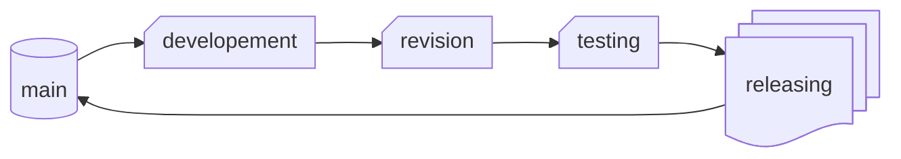
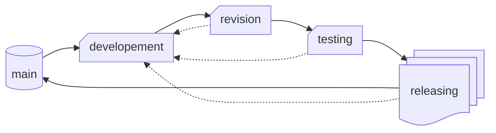
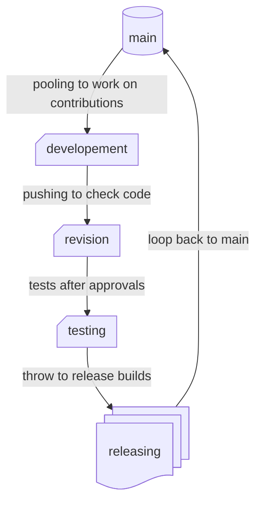

# proper cycle of changes through branches

### Community-driven coding of [[opSor]] society

---
#### standar branches workflow inside repository
> part of B.O.S. methods scenarios of "standarized technomantics" implemented in Inceptorium Apokryf behavioral guidebook for SEIAIC offices

 

---

### minimal list of branches in every repository:
- `main` 
	- spine of canon
- `developement` 
	- further changing
- `revision` 
	- controll of codes
- `testing` 
	- quality assurement
- `releasing` 
	- stamping, publishing and announcing

---
### **main** branch

- current stable state of code shared with [[LTS]] production released to be used by casual users
- most important repo's branch that carries canonical spine of versions management

---
### **developement**  branch

- pulled from main on opened [[workshop]] to make changes in source code
- **HERE WE CODE**

---
###  **revision** branch 
- pushed from developement changes to be checked by [[Audit Committee]] representant 
- _[[maintainer]] or someone that receives authority from [[maintainer]], if [[maintainer]] is the author of change then after [[automated checks of integrity]] it can be self-approved_ **NOTE:** always it is healthier to give someone else your code to [[approval]] then make it solo

---
### **testing** branch
-  [[unit tests]] and other examination of version at execution of codes after revision
-  here we build nightly releases that remains labeled as most recent and unstable
-  these builds are signed with other certs than official releasings

---
### **releasing** branch 
- final station where version waits for [[releasing procedures]]
-  after been released it lands in main branch after [[pull request]] is passed through

--- 
#### branches workflow including rejects exceptions that requires further improovements

  

---

#### full branches workflow with detailed description without exceptions

  

---

---

### references related to this topic:

> - https://en.wikipedia.org/wiki/Git
> - https://en.wikipedia.org/wiki/GitHub
> - https://en.wikipedia.org/wiki/Gitea
> - https://en.wikipedia.org/wiki/Collaborative_development_environment
> - https://en.wikipedia.org/wiki/Time_management#Implementation_of_goals
> - https://en.wikipedia.org/wiki/Free_and_open-source_software
> - https://en.wikipedia.org/wiki/Open-source_license
> - https://en.wikipedia.org/wiki/The_Open_Source_Definition
